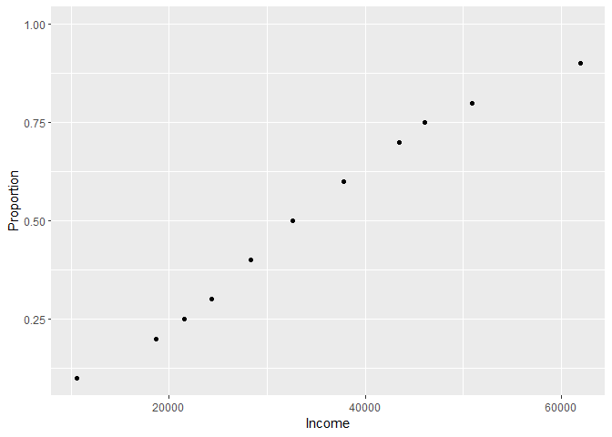
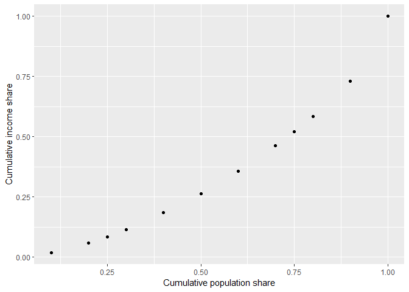

Estimating Inequality Measures from Quantile Data
================
Enora Belz (<enora.belz@univ-rennes1.fr>)
August 2019

### Library

A R package was written with all functions used.

``` r
library(devtools)
devtools::install_github("EnoraBelz/Inequality")
library(inequalityQuantile)

library(tidyverse)
library(binequality)
```

Parisian iris data : Bel Air 5
==============================

The Institut National de la Statistique et des Études Économiques (INSEE) provides income data at a very narrow scale named iris (<https://www.insee.fr/fr/statistiques/3288151>). The deciles and quartiles of income in these areas are available. The income ranges are determined from the quantiles. The aim is to model a Lorenz curve and inequality measures from these quantiles.

``` r
data("tabulated_income")

tabulated_BelAir5 = tabulated_income %>% filter(iris== "Bel Air 5")
```

| Iris      |  Bound (min)|  Bound (max)|  Population share|  Cumulative population share|
|:----------|------------:|------------:|-----------------:|----------------------------:|
| Bel Air 5 |            0|        10570|              0.10|                         0.10|
| Bel Air 5 |        10570|        18696|              0.10|                         0.20|
| Bel Air 5 |        18696|        21558|              0.05|                         0.25|
| Bel Air 5 |        21558|        24344|              0.05|                         0.30|
| Bel Air 5 |        24344|        28298|              0.10|                         0.40|
| Bel Air 5 |        28298|        32626|              0.10|                         0.50|
| Bel Air 5 |        32626|        37782|              0.10|                         0.60|
| Bel Air 5 |        37782|        43444|              0.10|                         0.70|
| Bel Air 5 |        43444|        46088|              0.05|                         0.75|
| Bel Air 5 |        46088|        50926|              0.05|                         0.80|
| Bel Air 5 |        50926|        61920|              0.10|                         0.90|
| Bel Air 5 |        61920|           NA|              0.10|                         1.00|

These points represent points of the cumulative distribution function. 

Incomes shares
==============

The first step is to determine the parameters of the GB2 distribution by MLE. The parameters are used to identify density and distribution of income in the area. Conditional means of income ranges can then be calculated. Those means are used to compute the cumulative shares of income. The cumulative shares of populations are merely the quantiles. It can then be applied to the Bel Air 5 iris data.

``` r
LC_BelAir5 = compute_LC(ID=tabulated_BelAir5$iris,
                        p=tabulated_BelAir5$prop_cum_population,
                        bound_min = tabulated_BelAir5$bound_min,
                        bound_max = tabulated_BelAir5$bound_max,
                        nb = tabulated_BelAir5$prop_population,
                        method = "CondExp")
```

    ## Time difference of 0.1575758 secs
    ## for GB2 fit across 1 distributions 
    ## 

| Iris      |  Bound (min)|  Bound (max)|  Mean Income|  Cumulative income share|  Cumulative population share|
|:----------|------------:|------------:|------------:|------------------------:|----------------------------:|
| Bel Air 5 |            0|        10570|      7403.64|                     0.02|                         0.10|
| Bel Air 5 |        10570|        18696|     14947.50|                     0.06|                         0.20|
| Bel Air 5 |        18696|        21558|     20135.63|                     0.08|                         0.25|
| Bel Air 5 |        21558|        24344|     22948.68|                     0.12|                         0.30|
| Bel Air 5 |        24344|        28298|     26296.94|                     0.18|                         0.40|
| Bel Air 5 |        28298|        32626|     30412.82|                     0.26|                         0.50|
| Bel Air 5 |        32626|        37782|     35113.38|                     0.36|                         0.60|
| Bel Air 5 |        37782|        43444|     40488.39|                     0.46|                         0.70|
| Bel Air 5 |        43444|        46088|     44737.59|                     0.52|                         0.75|
| Bel Air 5 |        46088|        50926|     48410.77|                     0.58|                         0.80|
| Bel Air 5 |        50926|        61920|     55936.68|                     0.73|                         0.90|
| Bel Air 5 |        61920|           NA|    102703.30|                     1.00|                         1.00|

We then obtain points of the Lorenz curve. 

Functional form optimization
============================

To approximate the empirical Lorenz curve, all alternative functional forms can be applied on the cumulative shares of income and population.

The parameters are optimized by NLS estimator. For each functional form, the most optimal parameters and Lorenz curve are obtained. The different forms could also be compared with each other using goodness-of-fit measures.

We define a function for optimizing the parameters of a functional form according to a NLS estimator and considering the different constraints on the parameters.

It is then possible to apply it to the calculated shares for the Bel Air 5 iris.

``` r
optim_BelAir5 = run_optim_LC(ID=unique(LC_BelAir5$ID),
           income_cum = LC_BelAir5$income_cum,
           population_cum = LC_BelAir5$population_cum,
           function_form=c("KP", "RGKO", "ARNOLD", "CHOTIKAPANICH", "SARABIA", "ORTEGA", "ROHDE")) 
```

    ## [1] "Bel Air 5"

| Iris      | Functional form |  Parameter 1|  Parameter 2|  Parameter 3|  Parameter 4|      NLS|  Chi-squared statistic|
|:----------|:----------------|------------:|------------:|------------:|------------:|--------:|----------------------:|
| Bel Air 5 | KP              |        1.000|        1.426|           NA|           NA|  0.00376|                 0.0103|
| Bel Air 5 | RGKO            |        0.726|        1.446|           NA|           NA|  0.00020|                 0.0015|
| Bel Air 5 | ARNOLD          |        1.279|        2.219|           NA|           NA|  0.00238|                 0.0149|
| Bel Air 5 | CHOTIKAPANICH   |        2.227|           NA|           NA|           NA|  0.00319|                 0.0110|
| Bel Air 5 | SARABIA         |        0.000|        0.692|        1.761|        0.301|  0.00003|                 0.0004|
| Bel Air 5 | ORTEGA          |        0.470|        0.649|           NA|           NA|  0.00014|                 0.0011|
| Bel Air 5 | ROHDE           |        1.532|           NA|           NA|           NA|  0.00260|                 0.0215|

Inequality measures
===================

The Lorenz curve is used to compute inequality indices (Gini, Pietra, Theil indexes).

Gini Index
----------

Gini coefficients can be derived from the functional forms as a function of parameters.

``` r
optim_BelAir5 %>% ungroup() %>% rowwise() %>% 
  dplyr::mutate(Gini_est = compute_Gini(function_form=function_form,
                                        par1=par1,
                                        par2=par2,
                                        par3=par3,
                                        par4=par4))
```

| Iris      | Functional form |  Gini Index|
|:----------|:----------------|-----------:|
| Bel Air 5 | KP              |      0.3447|
| Bel Air 5 | RGKO            |      0.3508|
| Bel Air 5 | ARNOLD          |      0.3422|
| Bel Air 5 | CHOTIKAPANICH   |      0.3437|
| Bel Air 5 | SARABIA         |      0.3562|
| Bel Air 5 | ORTEGA          |      0.3516|
| Bel Air 5 | ROHDE           |      0.3401|

Pietra Index
------------

The Pietra index is defined in terms of the Lorenz curve, it corresponds to the maximum deviation between *L*(*p*) and *p*.

``` r
optim_BelAir5 %>% ungroup() %>% rowwise() %>% 
  dplyr::mutate(Pietra_est = compute_Pietra(function_form=function_form,
                                            par1=par1,
                                            par2=par2,
                                            par3=par3,
                                            par4=par4))
```

| Iris      | Functional form |  Pietra Index|
|:----------|:----------------|-------------:|
| Bel Air 5 | KP              |        0.2613|
| Bel Air 5 | RGKO            |        0.2482|
| Bel Air 5 | ARNOLD          |        0.2594|
| Bel Air 5 | CHOTIKAPANICH   |        0.2611|
| Bel Air 5 | SARABIA         |        0.2443|
| Bel Air 5 | ORTEGA          |        0.2475|
| Bel Air 5 | ROHDE           |        0.2585|

Theil Indexes
-------------

The Theil'L index is defined in terms of the Lorenz curve, it corresponds to *T*<sub>*L*</sub> = −∫<sub>0</sub><sup>1</sup>log(*L*′(*p*))*d**p* and the Theil'H to *T*<sub>*H*</sub> = ∫<sub>0</sub><sup>1</sup>*L*′(*p*)log(*L*′(*p*))*d**p*.

``` r
optim_BelAir5 %>% ungroup() %>% rowwise() %>% 
  dplyr::mutate(TL_est = compute_TL(function_form=function_form,
                                    par1=par1,
                                    par2=par2,
                                    par3=par3,
                                    par4=par4))
```

| Iris      | Functional form |  Theil'L Index|
|:----------|:----------------|--------------:|
| Bel Air 5 | KP              |         0.2053|
| Bel Air 5 | RGKO            |         0.2211|
| Bel Air 5 | ARNOLD          |         0.1893|
| Bel Air 5 | CHOTIKAPANICH   |         0.1988|
| Bel Air 5 | SARABIA         |         0.2402|
| Bel Air 5 | ORTEGA          |         0.2250|
| Bel Air 5 | ROHDE           |         0.1832|

``` r
optim_BelAir5 %>% ungroup() %>% rowwise() %>% 
  dplyr::mutate(TH_est = compute_TH(function_form=function_form,
                                    par1=par1,
                                    par2=par2,
                                    par3=par3,
                                    par4=par4))
```

| Iris      | Functional form |  Theil'H Index|
|:----------|:----------------|--------------:|
| Bel Air 5 | KP              |         0.1854|
| Bel Air 5 | RGKO            |         0.2136|
| Bel Air 5 | ARNOLD          |         0.1836|
| Bel Air 5 | CHOTIKAPANICH   |         0.1840|
| Bel Air 5 | SARABIA         |         0.2868|
| Bel Air 5 | ORTEGA          |         0.2206|
| Bel Air 5 | ROHDE           |         0.1832|

Topshares
---------

``` r
optim_BelAir5 %>% ungroup() %>% rowwise() %>% 
  dplyr::mutate(topshare95 = compute_topshare(p=0.95,
                                              function_form=function_form,
                                              par1=par1,
                                              par2=par2,
                                              par3=par3,
                                              par4=par4))
```

| Iris      | Functional form |  Topshare 95%|
|:----------|:----------------|-------------:|
| Bel Air 5 | KP              |        0.1154|
| Bel Air 5 | RGKO            |        0.1601|
| Bel Air 5 | ARNOLD          |        0.1266|
| Bel Air 5 | CHOTIKAPANICH   |        0.1181|
| Bel Air 5 | SARABIA         |        0.1847|
| Bel Air 5 | ORTEGA          |        0.1635|
| Bel Air 5 | ROHDE           |        0.1317|
